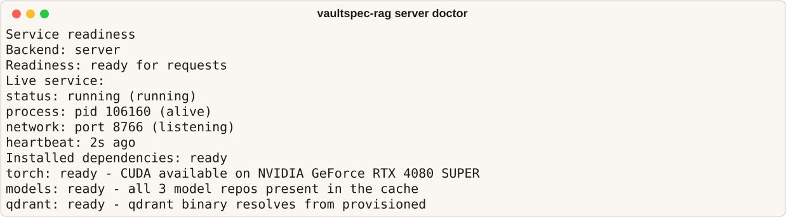
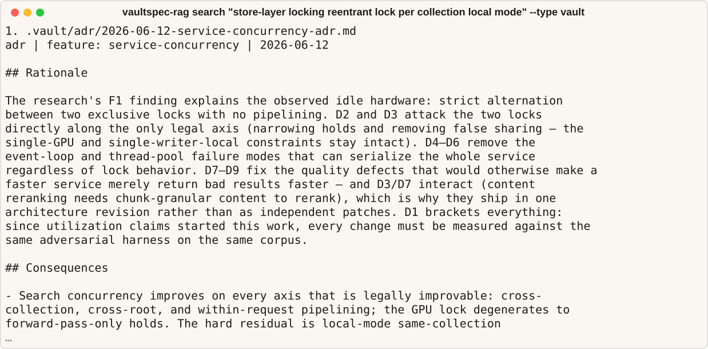
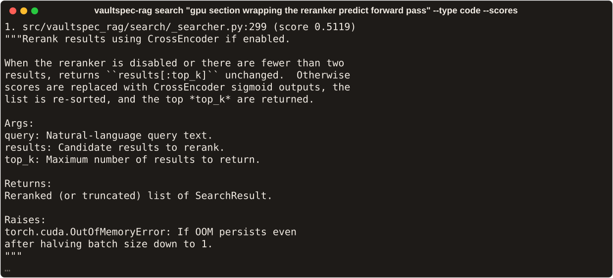
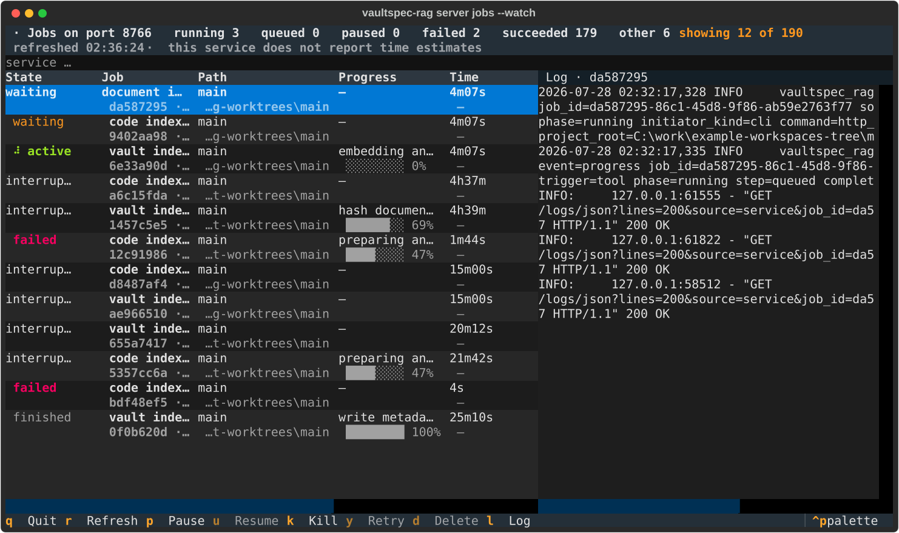

# vaultspec-rag

The semantic search component for vault and code.

Search code and feature records by meaning through the command line or Model Context
Protocol (MCP). Inference runs on your GPU.

[](https://github.com/nevenincs/vaultspec-rag/actions/workflows/ci.yml)
[](https://pypi.org/project/vaultspec-rag/)
[](#what-you-need)
[](./LICENSE)

[Install](#install) · [Use it](#use-it) ·
[Docs](#documentation) · [Help](#status-and-help)

For example, find records about concurrent file writes:

```bash
vaultspec-rag search "file lock concurrent write per-root" --type vault
```

```
1. .vault/audit/large-index-resilience-ledger-concurrency-audit.md
   audit | feature: large-index-resilience | 2026-08-13
   # `large-index-resilience` audit: `ledger concurrency`

   ## Scope

   Mandatory review of the durable-state concurrency work: write-ahead logging on
   the shared per-root ledger, integrity verification move
```

Every result gives you the file, what kind of record it is, and the passage that
matched.

Use it with [vaultspec-core](https://github.com/nevenincs/vaultspec-core) or
independently in another repository. To index PDFs and other formats,
[connect a converter](#read-pdfs-and-other-formats).

## What you need

Indexing and search require:

- Python 3.13 or 3.14 and [uv](https://docs.astral.sh/uv/getting-started/installation/).
- On Linux and Windows, an NVIDIA GPU with a working CUDA driver and roughly 3 GiB
  of free video memory. On macOS, Apple silicon.
- 16 GiB of system RAM and at least 8 GiB free on the index volume for the default
  `managed-service` profile. Packages and model files need additional disk space.

For smaller projects, the `embedded-local` profile lowers the minimums to 8 GiB RAM
and 5 GiB free disk. Set `VAULTSPEC_RAG_INDEX_SUPPORT_PROFILE=embedded-local` in the
environment that starts the service; `--local-only` alone does not change these
minimums. See [resource requirements](docs/installation.md#what-you-need-before-you-start).

CPU-only machines and AMD GPUs are unsupported; inference has no CPU fallback.

## Install

Install a standalone tool for use across repositories. Choose the command for your
platform. These CUDA commands use Python 3.13 and pin the GPU wheel so later tool
upgrades retain it.

Windows x64:

```powershell
uv tool install --python 3.13 "vaultspec-rag[gpu,mcp]" --with "torch @ https://download.pytorch.org/whl/cu130/torch-2.13.0%2Bcu130-cp313-cp313-win_amd64.whl"
```

Linux x86_64 (glibc 2.28 or newer):

```bash
uv tool install --python 3.13 "vaultspec-rag[gpu,mcp]" --with "torch @ https://download.pytorch.org/whl/cu130/torch-2.13.0%2Bcu130-cp313-cp313-manylinux_2_28_x86_64.whl"
```

Apple silicon macOS:

```bash
uv tool install --python 3.13 "vaultspec-rag[gpu,mcp]"
```

For other Python versions or Linux architectures, see [GPU wheel selection](docs/installation.md#pin-the-gpu-build).
If uv reports that its executables directory is missing from `PATH`, follow its
instructions before continuing. For an existing tool installation, follow the
[upgrade and repair instructions](docs/installation.md#pin-the-gpu-build) before
replacing its environment.

Once installation succeeds, open the repository you want to search and run:

```bash
vaultspec-rag install --no-torch-config
```

This installs the repository's agent integration, downloads the three search models,
and provisions Qdrant, the index server. The GPU packages are already installed, so
`--no-torch-config` leaves the project's PyTorch configuration alone. The first setup
downloads several gigabytes; subsequent projects share the models and server binary.

Check the installation:

```bash
vaultspec-rag server doctor
```

<p align="center">

</p>

Check that the report detects your GPU and finds all three models and the Qdrant
binary. If it reports a problem, use the [installation troubleshooting guide](docs/installation.md#when-something-goes-wrong).

## Use it

Start the service to load the models. The command waits until it is ready:

```bash
vaultspec-rag server start
```

Index the repository from its root:

```bash
vaultspec-rag index
```

The first index can take several minutes. The service then watches for file changes
and updates the index automatically. Use `vaultspec-rag server jobs --watch` to
inspect indexing progress.

Search source code with `--type code`, or feature records with `--type vault`:

```bash
vaultspec-rag search "parse query text into filters" --type code
```

<p align="center">

</p>

If no results appear, run `vaultspec-rag server status`: exit code 5 means the models
are still loading. Check `vaultspec-rag status` to see whether indexing has finished.
If both are ready, [report the query and result](https://github.com/nevenincs/vaultspec-rag/issues).

One service handles all your repositories. Run `index` in each repository you want
to search. See [index maintenance](docs/search-and-index.md) for rebuilding or
removing indexed content.

### Other ways to install

For a Python project that should carry the dependency, run:

```bash
uv add "vaultspec-rag[gpu]"
uv run vaultspec-rag install --sync
```

Approve the PyTorch configuration prompt. On Linux and Windows, `--sync` applies the
CUDA package source; macOS uses the standard MPS-capable wheel. Prefix subsequent
commands with `uv run`, for example `uv run vaultspec-rag server start`.

Without a Python toolchain, use the [prebuilt Windows or Linux binaries](docs/installation.md#install-without-python).

### Where it puts things, and how to remove it

By default the index lives in the shared service storage under `~/.vaultspec-rag/`, with
your project's data kept in its own namespace. Your project directory only holds run
metadata, in `.vault/data/search-data/`. The models and the server binary are also shared
across every project on the machine, in `~/.cache/huggingface/` and `~/.vaultspec-rag/`.
Expect the index itself to be substantial: this repository's namespace is about 1.3 GiB.

To remove it:

```bash
vaultspec-rag uninstall --force
```

Without `--force` it only shows you what it would delete. Adding `--remove-data` clears
`.vault/data/`, but your indexed content stays in the shared storage. To reclaim that
space, run `vaultspec-rag server storage survey` to find the namespace and
`vaultspec-rag server storage delete` to remove it. `server storage prune` clears every
namespace whose project directory is gone. See
[storage maintenance](docs/storage-maintenance.md).

## Write a query that finds it

This matters more than any flag. Describe the **behaviour**, and include the **words the
code or document would use**. Both halves do work: the description finds things
that mean the same, the specific words find exact matches.

One noun on its own gives the search almost nothing to go on:

```bash
vaultspec-rag search "locking" --type vault
```

```
1. .vault/adr/threading-lock-for-singleton-adr.md
2. .vault/audit/code-document-index-boundary-s18-document-store-audit.md
3. .vault/exec/service-hardware-singleton/...-service-lock-step.md
```

Describe what happens, and name the specifics:

```bash
vaultspec-rag search "file lock concurrent write per-root" --type vault
```

```
1. .vault/audit/large-index-resilience-ledger-concurrency-audit.md
2. .vault/research/service-concurrency-research.md
3. .vault/adr/store-eviction-log-rotation-adr.md
```

Same topic. The first scatters across unrelated features that merely mention locks. The
second returns three records about concurrent writes. More in [writing a query](docs/query-craft.md).

## Narrow the results

Try these in order.

1. **Search one thing at a time.** `--type code`, `--type vault`, or `--type document`.
   For decisions specifically, add `--doc-type adr`.

1. **Limit where it looks.** `--language python`, `--include-path "src/**"`,
   `--exclude-path "**/legacy/**"`. Use `--include-path` for a subtree or glob;
   `--path` matches one exact path.

1. **Hide the noise.** Code searches compete against tests, generated files, vendored
   dependencies, and worktree copies. Steer with inline words in the query itself:

   ```bash
   vaultspec-rag search "fixture setup helpers exclude:tests" --type code
   ```

   `exclude:` hides a group, `only:` keeps only what you name, `include:` brings back one
   that's hidden by default. The groups are `prod`, `tests`, `docs`, `locale`,
   `generated`, `vendored`, and `worktree`.

Asking for more results won't help. That gives you more of the same ranking, not a better
one - narrow the search instead.

<p align="center">

</p>

## Check on the index

`vaultspec-rag status` tells you what's indexed, where it's stored, and which GPU it's
using. `vaultspec-rag server doctor` tells you whether the service, models, and search
server are ready.

To watch indexing as it happens, `vaultspec-rag server jobs --watch` opens a live view of
the running service. You get progress per job, what's waiting on the GPU, and the log for
whichever job you select.

<p align="center">

</p>

If the index has fallen behind, run `vaultspec-rag index` again - it only picks up what
changed. See [verify the index](docs/verification.md).

## Use it from an AI assistant

Claude Code and other MCP clients can search your project directly. MCP is the Model
Context Protocol, a standard way to give AI tools access to things like this.

Start the service first, then add this to `.mcp.json` in your project:

```json
{
  "mcpServers": {
    "vaultspec-rag": {
      "command": "vaultspec-search-mcp",
      "env": { "VAULTSPEC_RAG_ROOT": "${workspaceFolder}" }
    }
  }
}
```

You need the `mcp` extra installed for this. It gives the assistant twelve tools: four
kinds of search, one to fetch a file, one to report index status, four to re-index, and
two to clear the index. Add `--read-only` to offer only the ones that read. See
[MCP integration](docs/mcp.md).

## Run without the search server

By default, vaultspec-rag runs a managed Qdrant server to hold the index. For a small
project, `--local-only` selects an on-disk store and skips the Qdrant server download.
It still needs the GPU and model files.

Stop any running service with `vaultspec-rag server stop`. Set
`VAULTSPEC_RAG_INDEX_SUPPORT_PROFILE=embedded-local` in the environment that will
start it, then configure the repository:

```bash
vaultspec-rag install --local-only --no-torch-config
```

Start the service and index the repository as above. The local store handles searches
one at a time and has its own index; changing backends does not copy existing indexed
content. See [backends](docs/backends.md) for storage locations and limitations.

## Read PDFs and other formats

vaultspec-rag reads code and Markdown on its own. For anything else - PDFs,
spreadsheets - you connect a converter, and vaultspec-rag indexes what it produces. You
define them in a `.vaultragpreprocess.toml` file. The docs and the CLI call these
preprocessing hooks, which is why the command below is `preprocess`. See
[preprocessing hooks](docs/preprocessing-hooks.md).

Read the next part before you use someone else's.

### What a converter is allowed to do

**A converter runs whatever command it names, with your user account's permissions.
Nothing sandboxes it and nothing checks it against a list of approved commands.**

Indexing a repository therefore means trusting that repository, exactly as running its
`make` or `npm install` does.

It also runs more often than you might expect:

- when you run `vaultspec-rag index`
- whenever the service notices a matching file change - with no command from you
- on any re-index request, including from an AI assistant

The limits that exist stop a runaway converter, not a hostile one. It runs in a separate
process, under a time limit, with its output capped, and with your environment variables
stripped down so passwords and tokens in them don't reach it. That last one isn't a
security boundary. The converter runs as your account: it can read and write any file you
can, and reach the network exactly as you can.

Before you use a converter you didn't write:

- Read the `.vaultragpreprocess.toml` and every command it runs, the way you'd read a
  build script.
- Run `vaultspec-rag preprocess status` first. It tells you whether a project defines
  converters and whether they'd run - without running anything.
- **Don't index a repository you wouldn't build.**

To turn converters off completely, set `VAULTSPEC_RAG_PREPROCESS=off`. That overrides
everything else. `server start --no-preprocess` disables them for that service. Note that
`index --no-preprocess` only applies when indexing runs in-process: if a service is
already running, `index` hands the work to it and the flag has no effect.

## How it works

A background service holds the models and the index. One service per machine; the index
itself is per project.

Indexing reads your files once, then keeps up by watching for changes.

A search matches two ways at once - by meaning, and by exact words. A third, slower model
then re-scores the best few results to put the strongest first. That last step is where
most of a search's time goes, and the two-way matching is why
[how you word a query](#write-a-query-that-finds-it) changes so much.

Read the [architecture overview](docs/architecture.md) for the detail.

## Scripting it

Every command except `server warmup` takes `--json`. You get one JSON object on stdout,
and nothing else - logs go to stderr.

```json
{ "ok": true, "command": "search", "data": { "results": [] } }
```

When something fails you get `"ok": false` with `error` and `message`. Branch on the
`error` value, such as `port_unreachable`, `local_store_locked`, or `stopped`, rather
than on the message text.

| Exit code | Meaning                                    |
| --------- | ------------------------------------------ |
| 0         | Worked                                     |
| 1         | Failed - GPU error, busy index, no service |
| 2         | You passed a bad argument or flag          |
| 3         | Service isn't running                      |
| 4         | Service crashed, or its state disagrees    |
| 5         | Service is still loading - try again       |

See [automation](docs/automation.md).

## Documentation

**Start here**

- [Getting started](docs/getting-started.md) - install, index, and search, end to end.
- [Installation](docs/installation.md) - GPU-specific PyTorch details and how to recover
  a broken setup.

**Using it**

- [Search and index](docs/search-and-index.md) - running searches and refreshing the
  index.
- [Writing a query](docs/query-craft.md) - phrasing, every filter, and what to do when
  results look wrong.
- [Retrieval recipes](docs/examples.md) - worked examples, including questions it answers
  badly.
- [Verify the index](docs/verification.md) - check the service is healthy and the index
  covers what you meant.
- [Service mode](docs/service-mode.md) - keeping the models loaded in the background.
- [Backends](docs/backends.md) - managed server versus on-disk store.
- [MCP integration](docs/mcp.md) - connecting AI clients.
- [Automation](docs/automation.md) - JSON output and scripting.
- [Preprocessing hooks](docs/preprocessing-hooks.md) - connecting converters, and the
  trust model.

**Looking things up**

- [CLI reference](docs/cli.md) - every command, flag, and exit code.
- [Configuration](docs/configuration.md) - settings, environment variables, defaults.
- [Service discovery](docs/service-discovery.md) - the `service.json` contract.
- [Glossary](docs/glossary.md) - every term used across these docs.

**How it works**

- [Architecture](docs/architecture.md) - the design, and why a GPU is required.
- [Indexing](docs/indexing.md) - indexing and retrieval internals.

## Status and help

vaultspec-rag is Beta. Report bugs and ask questions on the
[issue tracker](https://github.com/nevenincs/vaultspec-rag/issues).

Please include five things: your vaultspec-rag version, your operating system, your GPU,
the command you ran, and the full error output. With those, someone can reproduce the
problem. Without them, it's guesswork.

## Related projects

| Project                                                       | Maturity | Role                                                   |
| ------------------------------------------------------------- | -------- | ------------------------------------------------------ |
| [vaultspec-core](https://github.com/nevenincs/vaultspec-core) | Beta     | Decision-driven harness for coding agents, and humans. |
| **vaultspec-rag**                                             | Beta     | The semantic search component for vault and code.      |

[vaultspec-dashboard](https://github.com/nevenincs/vaultspec-dashboard) is a separate
project building a dedicated frontend on the same files. It is in early development, in
the open.

## For contributors

The [changelog](CHANGELOG.md) has release notes and version history. vaultspec-rag is
released under the [MIT License](./LICENSE).
